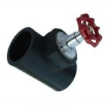
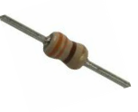
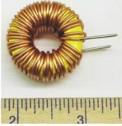
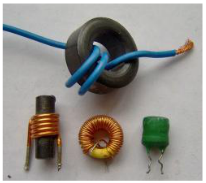
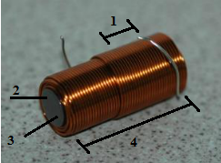
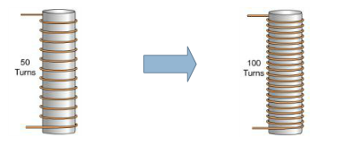
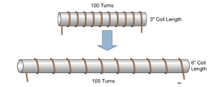
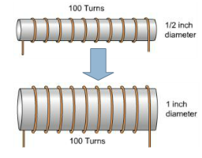
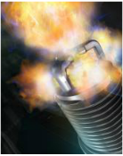

# Theory

### Function of an Inductor
The function of a valve is to control the amount of fluid that flows through a pipe.

Figure: 1 

In an electronic circuit, the resistor is used to control the amount of current that flows through a conductor.

Figure: 2 

Mother device that controls the current is the inductor .

Figure: 3 

However unlike the resistor that affects the current uniformly at all times, the inductor only affects currents when thy are changing in value.

### Similarity with Capacitor

- Rate of change of voltage in a capacitor depends upon the current through it
- Rate of change of current in an inductor depends upon the voltage applied across it.
- Like capacitive current , inductive current is not simply proportional to voltage
- Unlike the situation in a resistor, the power associated with inductive current (V times I) is not turned into heat but is stored as energy in the inductor’s magnetic field.

### Equation of an Inductor

$$V= L\frac{dl}{dt}$$ 
- L is the inductance and is measured in henry.
- Putting a voltage across an inductor causes the current to rise as a ramp
- 1 volt across 1 henry produces a current that increases at 1 amp per second

### Structure of an Inductor

Figure: 4 

It consists of a wire wound as a coil around a core. The core may consist of a air filled hollow tube or solid material.

### Inductance
The amount of inductance in henries a coil has, is determined by the following factors -
- No of turns of wire wound around the coil
- Cross sectional area of the coil
- The material type of the coil
- The Length of the coil

Figure: 5 

## Test Question

If the number of turns of coil around an inductor is increased ( doubles ), how will the inductance change ?

Figure: 6

- Increase
- Decrease
- Will Not Change

If the distance between the turns of coil around an inductor is increased ( doubles ), how will the inductance change ?

Figure: 6

- Increase
- Decrease
- Will Not Change

If the diameter of the coil around an inductor is increased(doubles),how will the inductance change?

Figure: 7

- Increase
- Decrease
- Will Not Change

### Inductive Kick

An Inductive is capable of producing a momentary voltage that is much higher than the voltage of th power source that supplied the current to create its magnetic field . This temporary voltage is called an inductive kick.

Figure: 8

Example of applications of inductive devices to provide an inductive kick is a Combustion Engine ignition system that creates the spark across the gap of the spark plug.

Slides:  [Familiarisation with Inductor](http://vlabs.iitkgp.ac.in/be/exp3/content/slides.html)

pdf:  [Familiarisation with Inductor](http://vlabs.iitkgp.ac.in/be/exp3/content/measuind.pdf)

